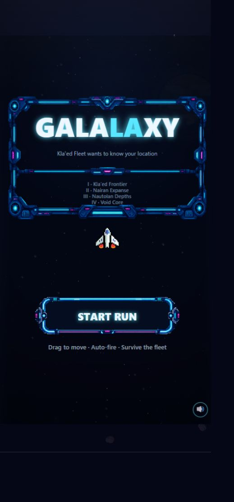
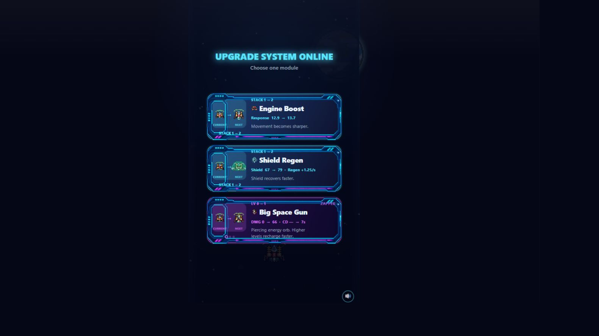
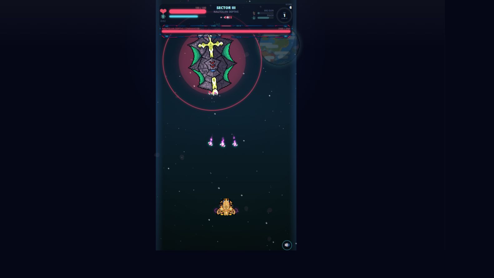
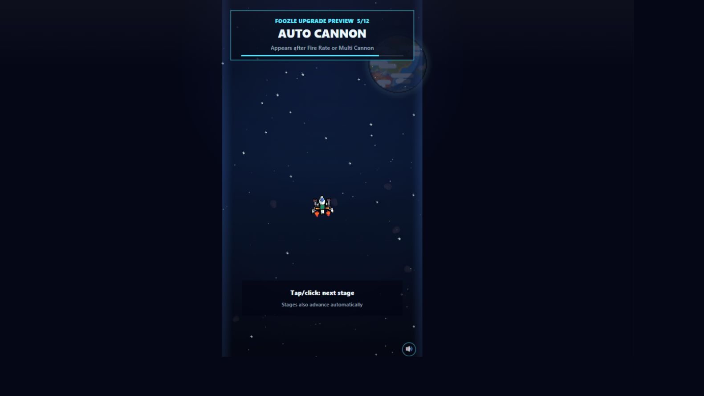

# Galalaxy

A mobile-first arcade space-survivor built with vanilla JavaScript and HTML5 Canvas. Guide an auto-firing ship through increasingly dangerous fleet sectors, collect energy and shape each run with visible weapon, engine and defensive upgrades.

## [▶ Play Galalaxy](https://emfau88.github.io/galalaxy/)

## Screenshots

<p align="center">
  
  
  
  
</p>

## Features

- Four escalating sectors with Kla'ed, Nairan and Nautolan fleets
- Boss encounters and a complete victory state
- Build-defining upgrades including multi-cannons, rockets, zapper, beam and pulse abilities
- Persistent upgrade modules and MK-I to MK-IV ship evolution
- Animated, fleet-specific enemy weapons and projectiles
- Portrait-oriented touch and mouse controls, auto-fire, music and a saved best score

## Controls

- **Touch or mouse:** drag to steer
- **Upgrade screens:** tap or click a card
- **Pause:** press `P`
- Weapons fire automatically

## Run locally

No build step or dependencies are required. Serve the repository through a local HTTP server:

```bash
python -m http.server 8765
```

Then open [http://127.0.0.1:8765/](http://127.0.0.1:8765/).

## QA

Open [the accelerated full-run check](http://127.0.0.1:8765/?test=full-run)
while the local server is running. It verifies staged asset loading, all four
sector transitions, the shared Nautolan fleet group, victory, replay and
return-to-hangar. A successful run changes the page title to
`Galalaxy QA PASS`; failures are reported in the browser console.

## Technology

HTML5 Canvas, CSS and native JavaScript modules.
