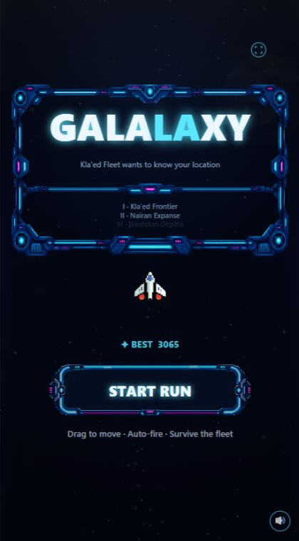
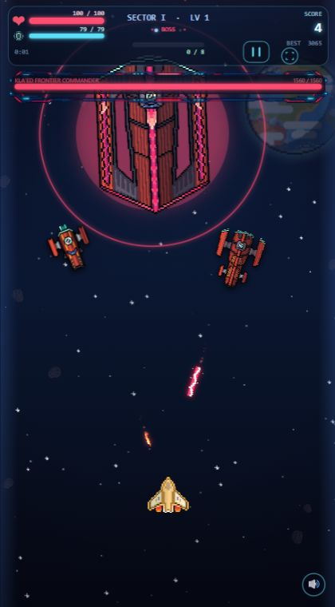
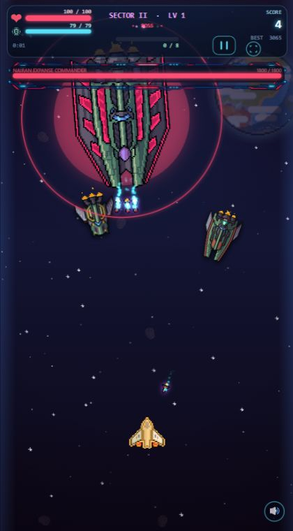
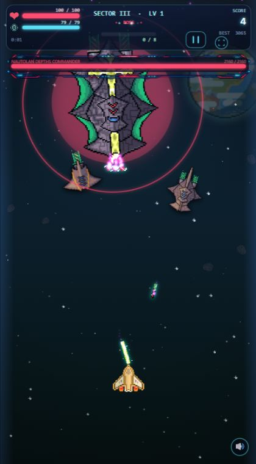
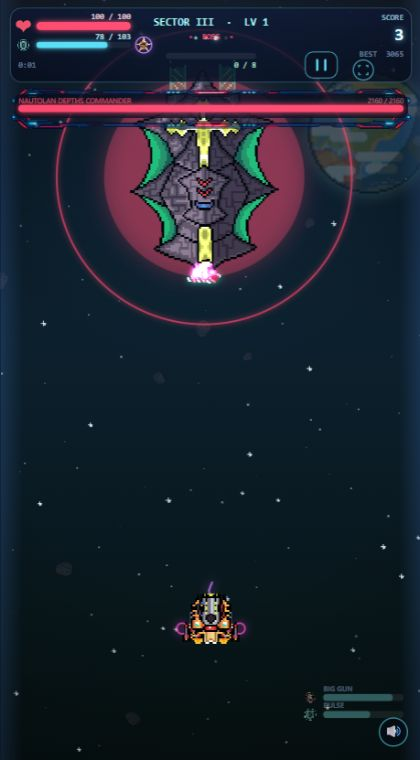
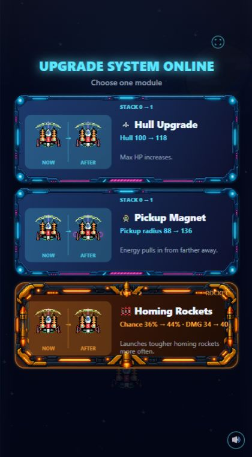
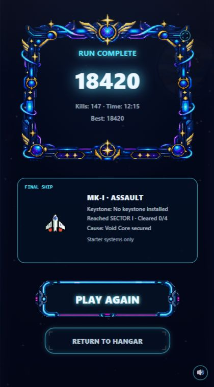

# Galalaxy – Bulk 0 Baseline

Stand: 24.09.2026

## Zweck

Diese Baseline hält den Zustand vor den geplanten Gameplay- und HUD-Änderungen
fest. Sie dient als Vergleich für die folgenden Bulks. In Bulk 0 wurden keine
Spielregeln, Balancewerte oder Renderpfade geändert.

## Kurzfazit

- Das Spiel und das Asset-Manifest bestehen die vorhandenen statischen Checks.
- Die Sektorintensität steigt zahlenmäßig, aber vor allem über Menge und Dauer.
- Sektor III und IV teilen dieselbe Nautolan-Flotte und denselben Boss.
- Das HUD ist funktional, aber die kritischen Hull-/Shield-Informationen sind
  auf Mobilgröße sehr klein.
- Im aktiven Spiel existieren nur XP-Pickups.
- Sechs vorhandene Schiffsarchetypen sind ungenutzt: je ein Support- und ein
  Torpedoschiff für Kla'ed, Nairan und Nautolan.
- Der beschleunigte Vollrun bestand drei direkte Wiederholungen. Ein vorheriger
  Versuch scheiterte sporadisch bei der Pause-/Schussprüfung. Das wird als
  möglicher Timing-Race beobachtet und in Bulk 0 nicht verändert.

## Messbare Ausgangswerte

| Sektor | Dauer ohne Boss | Flotte | Spawnfaktor | Geschwindigkeitsfaktor | Modellierte Gegner/s* |
|---|---:|---|---:|---:|---:|
| I | 70 s | Kla'ed | 0,9 | 0,9 | 1,14 |
| II | 90 s | Nairan | 1,0 | 1,0 | 1,59 |
| III | 105 s | Nautolan | 1,0 | 1,0 | 1,79 |
| IV | 115 s | Nautolan | 1,0 | 1,0 | 1,93 |

\* Erwartungswert der Spawnlogik einschließlich Formationen, ohne Gegnerlimit
und unter Annahme schnellen Abschusses. Der Wert beschreibt die relative
Druckentwicklung, nicht die tatsächlich gleichzeitig sichtbare Gegnerzahl.

- Reguläre Sektorzeit insgesamt: 380 Sekunden plus Bosskämpfe und Auswahlzeit.
- Der Sprung von Sektor III zu IV beträgt im Modell nur rund 8 % mehr Körper pro
  Sekunde. Gleichzeitig ist das Spielerschiff stärker.
- Sektor I besitzt nur für die ersten 10 Sekunden ein fest ruhigeres Intervall.
- Formationen sind in Sektor I bis Sekunde 22 gesperrt.
- Startwerte des Spielers: 100 Hull, 55 maximales Schild, aber nur 35 aktuelles
  Schild. Der normale Run beginnt somit sichtbar nicht voll geladen.
- XP-Anforderungen der ersten Stufen: 8, 14, 21, 30, 42, 57, 76, 101.

## Progressionsbefund

Der Zahlenanstieg ist vorhanden, die spielerische Veränderung aber schwächer:

1. Sektor I beginnt kurz ruhig und wechselt danach relativ schnell in die
   normale Spawnkurve.
2. Sektor II erhöht Geschwindigkeit, HP und Druck, verwendet aber dieselben
   grundlegenden Bewegungs- und Spawnstrukturen.
3. Sektor III führt die schwere Nautolan-Flotte ein.
4. Sektor IV wiederholt dieselbe Nautolan-Flotte. Auch der Boss besitzt dieselben
   Basiswerte und dasselbe Angriffsmuster wie in Sektor III.

Das erklärt, warum Sektor II bis IV subjektiv ähnlich wirken können: Die Dichte
steigt, aber die verlangte Spielerentscheidung verändert sich kaum.

## HUD-Baseline

- Hull-Leiste: 94 × 8 Design-Pixel.
- Shield-Leiste: 94 × 6 Design-Pixel.
- Zahlen: 8-Pixel-Schrift.
- Die Leisten werden hauptsächlich durch Farbe und kleine Symbole unterschieden.
- Die Bossleiste sitzt direkt unter dem kompakten Spieler-HUD und besitzt deutlich
  mehr visuelles Gewicht.
- Im HUD-Test sind die Ability-Anzeigen unten rechts ebenfalls sehr klein.

Vergleichskriterium für Bulk 1: Hull und Shield müssen während eines Bosskampfs
innerhalb eines kurzen Blicks unterscheidbar und ablesbar sein.

## Pickup-Baseline

Im aktiven Spiel werden ausschließlich XP-Energiekugeln erzeugt. Die zwölf
vorhandenen Engine-, Shield- und Weapon-Pickup-Grafiken werden als Upgrade- und
Statusgrafiken verwendet, nicht als temporäre Kampf-Pickups.

## Ungenutzte Assets

Vorhanden, aber nicht als Gegner registriert:

| Flotte | Ungenutzte Rollen | Zugehörige Quelldateien/PNGs |
|---|---|---:|
| Kla'ed | Support Ship, Torpedo Ship | 24 |
| Nairan | Support Ship, Torpedo Ship | 24 |
| Nautolan | Support Ship, Torpedo Ship | 24 |

Zusätzlich vorhanden beziehungsweise registriert, aber aktuell nicht als
eigenständige Sektoridentität genutzt:

- mehrschichtige Sternenhintergründe,
- große und rotierende Sterne,
- Black-Hole-Grafik,
- Asteroiden-Explosion und Asteroiden-Flamme,
- Planet ohne Glow,
- Nautolan Bullet und Nautolan Wave.

## Technische Prüfungen

### Statische Checks

- `node scripts/reliability-check.mjs`: bestanden
- `node scripts/verify-assets.mjs`: bestanden
- 154 registrierte Dateien vorhanden
- 2,80 MiB komprimierte Bilddaten im Manifest
- geschätzte UI-RGBA-Dekodiergröße: 13,31 MiB nach Optimierung

### Beschleunigter Vollrun

- Erster gespeicherter Versuch: fehlgeschlagen bei der Pause-/Schussprüfung.
- Drei direkte Wiederholungen: bestanden.
- In den bestandenen Läufen bestätigt:
  - Übergang I → II,
  - Übergang II → III,
  - Übergang III → IV mit gemeinsam genutzter Nautolan-Gruppe,
  - Arena-Cleanup,
  - Upgrade-Warteschlange,
  - pausierte Simulationszeit,
  - Victory, Replay und Rückkehr zum Hangar.

Der einzelne Ausreißer wird vor Bulk 1 nicht repariert. Falls er in späteren
Wiederholungen erneut auftritt, sollte der Full-Run-Test deterministischer
gemacht werden.

## Visuelle Referenzen

### Titel

### Sektor I – Kla'ed

### Sektor II – Nairan

### Sektor III – Nautolan

### HUD-Stresstest

### Upgrade-Auswahl

### Victory

Für Sektor IV existiert keine eigenständige Live-QA-Szene. Das ist selbst ein
relevanter Baseline-Befund: Sektor IV verweist auf dieselbe Nautolan-Assetgruppe
wie Sektor III. Die vorhandene inszenierte Sektor-IV-Aufnahme liegt unter
`docs/kongregate/source/finale-assault.png`.

## Offene menschliche Stichprobe

Automatisierte Szenen können technische Abläufe, aber kein echtes Spielgefühl
messen. Vor der finalen Abnahme von Bulk 1 sollten drei bis fünf normale Runs
mit dem beiliegenden `playtest-sheet.md` protokolliert werden. Bis diese
Stichprobe vorliegt, werden keine erfundenen Überlebens- oder Auswahlquoten als
Baseline ausgegeben.

## Vergleichsfragen für die nächsten Bulks

1. Ist Sektor I mindestens 15 Sekunden lang klar ruhiger?
2. Ist der erste Upgradezeitpunkt sinnvoll, ohne das Tutorial zu unterbrechen?
3. Kann ein Spieler Hull und Shield im Kampf sofort benennen?
4. Verlangen Sektor II, III und IV unterschiedliche Bewegungsentscheidungen?
5. Hat Sektor IV einen eigenen Höhepunkt statt nur mehr Dauer?
6. Kommt ein build-definierendes Upgrade rechtzeitig zum Einsatz?
7. Bleibt die zentrale Kampffläche trotz neuer Dekoration übersichtlich?
