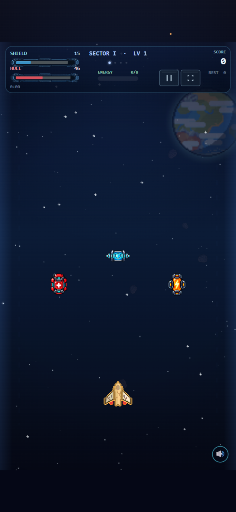

# Bulk A – technischer und visueller Prüfbericht

Stand: 24.09.2026

## Ergebnis

- Maus- und Touchsteuerung entsprechen weiterhin dem stabilen Ausgangsstand.
- Der isoliert neu aufgebaute WASD-Pfad wurde automatisch und anschließend in
  einem externen Desktop-Browser manuell bestätigt und ist nun Standard.
- `?controls=pointer` deaktiviert nur die Tastaturbewegung als sicherer
  Rückfallmodus. Der eingebettete Codex-Browser reicht physische WASD-Eingaben
  nicht zuverlässig an die Spielseite weiter.
- Repair, Shield und Overdrive verwenden drei neue transparente Pixel-Art-Sprites.
- Kreisrahmen und Objektbeschriftungen wurden entfernt.
- Es darf nur noch ein Kampf-Pickup gleichzeitig existieren.
- Der Mindestabstand erfolgreicher Drops beträgt 28 aktive Sekunden.
- Dropchance: ungefähr 3,25 % bei leichten bis maximal 6 % bei schweren Gegnern.
- Repair stellt 18 Hull, Shield 28 Schild wieder her; Overdrive hält 7 Sekunden.
- Normale Runs protokollieren Pickupanzahl und tatsächlich wiederhergestellte Werte.

## ImageGen

Modus: integriertes ImageGen, drei separate Generierungen, transparente Ausgabe.

Gemeinsame Stilvorgabe:

> Use case: stylized-concept. Collectible gameplay pickup sprite for a portrait
> arcade space shooter. The supplied references define the existing crisp
> top-down pixel-art language, dark metal outlines, saturated accent lights and
> readable small silhouettes. Genuinely transparent background. One centered,
> isolated object filling about 72% of a square canvas, deliberate chunky pixel
> clusters, limited palette, hard edges, subtle top-left highlight. Immediately
> readable at 32 pixels. No circular frame, halo, floor shadow, text, letters,
> border, UI panel, animation strip or extra objects.

Einzelmotive:

1. Rote, kompakte Sci-Fi-Reparaturkapsel mit weiß-rotem medizinischem Kreuz.
2. Blaue Schildbatterie mit cyanfarbener Schildplatte und zwei Seitenterminals.
3. Orangefarbener Overdrive-Reaktorkern mit Blitzkammer und vier Metallklammern.

Finale Projektdateien:

- `assets/pickups/runtime/repair-cell-v1.png`
- `assets/pickups/runtime/shield-battery-v1.png`
- `assets/pickups/runtime/overdrive-core-v1.png`

Die ausgewählten ImageGen-Ausgaben wurden anhand ihrer Alpha-Grenzen beschnitten,
mit Nearest-Neighbor auf 96 × 96 Pixel optimiert und nicht destruktiv als neue
versionierte Dateien gespeichert.

## Prüfungen

- `node scripts/reliability-check.mjs`: bestanden
- `node scripts/verify-assets.mjs`: bestanden, 161 registrierte Assets
- Syntaxprüfungen: bestanden
- `git diff --check`: bestanden
- Browser-Regression: bestanden
- Beschleunigter Vollrun Sektor I–IV: bestanden
- Browserkonsole und Assetantworten: keine Fehler
- Pickup-QA: alle drei Typen und alle drei Assets geladen

Maschinenlesbares Browserergebnis: `report.json`

Visuelle Referenz:

## Noch offene menschliche Abnahme

- Drei normale, nicht beschleunigte Runs spielen.
- Pro Run Pickupanzahl sowie Hull-/Schildwiederherstellung aus der Run-History
  auslesen.
- Bestätigen, dass die neue Dichte nicht mehr wie Pickup-Konfetti wirkt.

Bis diese drei normalen Balance-Runs vorliegen, bleibt Bulk A formal `TEILWEISE`.
